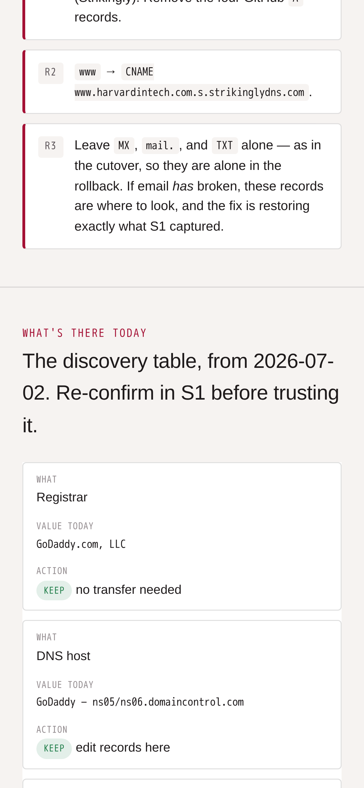
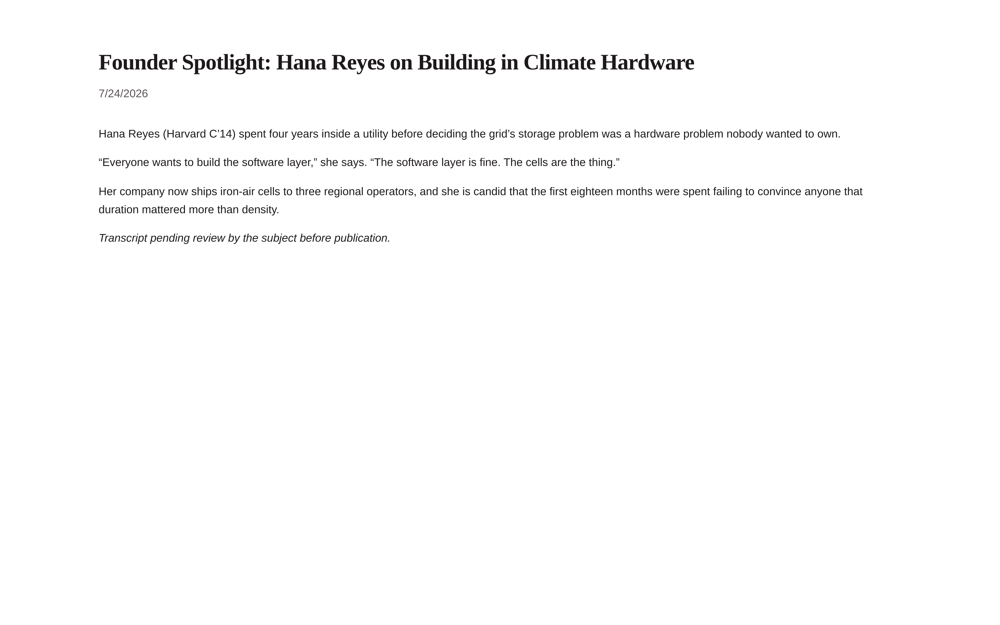
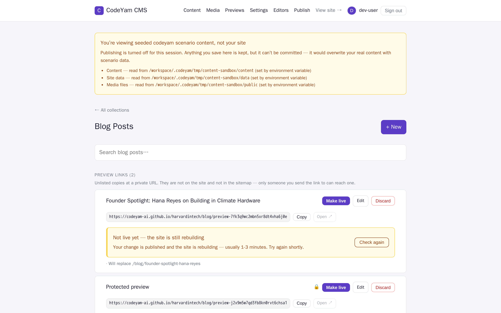
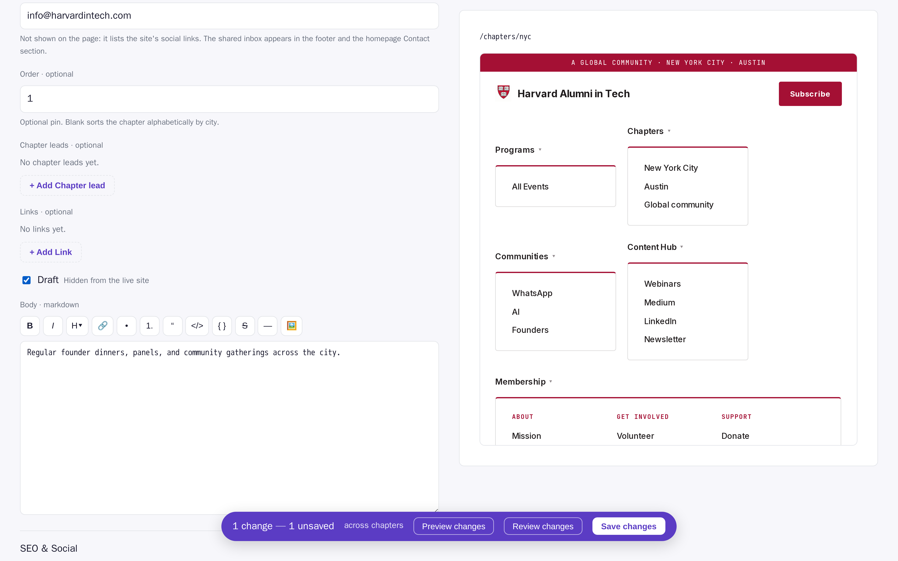
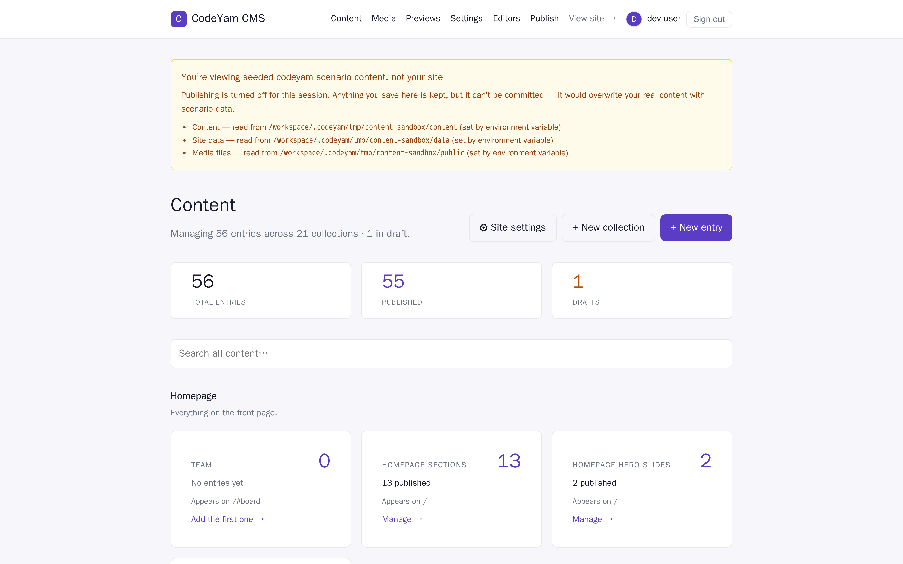

# Harvard in Tech

A modern, statically-exported [Astro](https://astro.build) rebuild of the
[Harvard in Tech](https://www.harvardintech.com/) website — a faithful
reproduction of the original (built on a no-code tool) using modern technology,
hostable for free on GitHub Pages.

Page content lives in typed
[content collections](https://docs.astro.build/en/guides/content-collections/)
(markdown under `src/content/`) and editable JSON singletons (`src/data/`), not a
runtime database — so there is no server to run.
[**@codeyam/cms**](https://www.npmjs.com/package/@codeyam/cms) edits those same
files: an Astro integration that owns **`/admin`** — content dashboard, entry
editor, media library, site settings, and a publish flow that batches edits into
one GitHub commit. See [`CMS_SETUP.md`](./CMS_SETUP.md) for the two sign-in
paths: **Local** and **Token** (paste a fine-grained GitHub PAT).

## Setup

```bash
npm run setup      # install dependencies (+ Playwright browser for captures)
npm run dev        # http://127.0.0.1:4321
npm run build      # type-check + static build into dist/
npm run test       # component unit tests (vitest + jsdom)
```

A fresh clone works with: `git clone` → `npm run setup` → `npm run dev`.

### Patched dependency

`@codeyam/cms` is pinned to an exact version and carries a local patch in
`patches/`, applied automatically by `patch-package` on `postinstall`. The patch
adds two admin controls the package does not ship: **reorder arrows** on any
collection declaring a numeric `order`, and **Duplicate** on every entry row,
which opens the ordinary create form prefilled from the source entry. Without
them, rearranging the donate page means opening each section and typing a number
while holding the other five in your head, and starting a section from an
existing one means retyping it. The version is pinned exactly because the patch
is version-stamped: a floating range would install a version the patch cannot
apply to and break `npm install` for everyone. **Duplicate landed upstream in
0.13.0**, so that half of the patch was deleted — the feature moved into the
dependency rather than out of the product. The reorder arrows are still ours.
Both are covered from this repo — `src/lib/cmsOrderControls.test.ts` for the
arrows, `src/lib/duplicateEntry.test.ts` now holding the released Duplicate to
its contract — so if a future release drops or reworks either, CI says so
instead of an editor finding the buttons gone. The arrows belong upstream too;
drop the rest of the patch once they land there. See `CMS_SETUP.md` for the
upgrade procedure.

## Project shape

```
src/
  pages/index.astro          # the landing page — composes the section components
  pages/volunteer.astro       # /volunteer — the volunteer pitch + open-projects grid
  pages/volunteer/projects/[slug].astro
                              # /volunteer/projects/<slug> — one page per project,
                              #   where a project's full markdown description renders
  pages/donate.astro          # /donate — the Momentum Fund campaign page
  pages/events.astro          # /events — Luma calendar embed + upcoming/past listing
  components/landing/         # one component per landing section (Hero, Board, …)
  components/volunteer/       # /volunteer sections (hero, benefits, project cards)
  components/donate/          # /donate campaign sections (hero, stats, gift pillars,
                              #   quotes, donor recognition wall)
  layouts/BaseLayout.astro    # site shell: data-driven header/nav + footer + SEO
  content/                    # typed content collections (events, team, chapters,
                              #   communities, pages, blog, projects, sponsors,
                              #   testimonials, donors, momentumSections, and the
                              #   page copy an editor owns: volunteerPage,
                              #   sponsorPage, sponsorLevels, siteIntegrations,
                              #   pageCopy)
  data/                       # settings.json + nav.json singletons, cms.json +
                              #   collections.json (CMS config). volunteerPage,
                              #   sponsorPage and donatePage still live here as the
                              #   FALLBACK behind their collections — the CMS has no
                              #   notion of a required singleton, so a deleted entry
                              #   degrades to this committed copy rather than a blank page
  lib/                        # site.ts, mailto.ts, drafts.ts (draft filtering),
                              #   personalize.ts (?name= hero personalization), giving.ts
  styles/tokens.css           # design tokens (brand blue, Roboto, spacing)
public/images/                # hero/section backgrounds, board graphic, event gallery
                              # (/admin is injected by @codeyam/cms — no admin code in this repo)
```

## Deploy to GitHub Pages

1. In `astro.config.mjs`, set `site` to your Pages URL and `base` to your repo
   path (drop `base` for a `<user>.github.io` root site).
2. Push to `main` — `.github/workflows/deploy.yml` enables Pages automatically
   (Source: **GitHub Actions**), then builds and deploys. No manual Settings →
   Pages toggle in the common case; see [`DEPLOY_SETUP.md`](./DEPLOY_SETUP.md)
   for the fallback if the first deploy 404s.

<!-- codeyam:run-and-edit:start d=52a406bfa5f4 -->
## Develop this project with codeyam-editor

This project is built with [codeyam-editor](https://codeyam.com) — code and runnable data scenarios are authored side by side against a live preview.

```bash
# Clone the repo
git clone https://github.com/codeyam-ai/harvardintech && cd harvardintech

# Install codeyam-editor
npm install -g @codeyam-editor/codeyam-editor@latest

# Launch the editor (split-screen terminal + live preview)
codeyam-editor start
```
<!-- codeyam:run-and-edit:end -->

<!-- codeyam:scenario-gallery:start d=814d84b1a97f -->
## Scenario gallery

States captured as runnable scenarios with codeyam-editor:

### Blog Post - A Retained Medium Stub


A blog post as a reader who still holds its link meets it. This scenario used to show the Welcome post, which was retired when the blog was hidden for launch — the owner decided on 2026-09-14 not to advertise a blog until there are real articles for it. So it now shows one of the ten Medium stubs instead, which is what a retained link actually resolves to: the posts keep building at their own URLs even with every route INTO the blog closed, so nobody holding an old link gets a 404. Note what is ABSENT — the back link that used to sit above the title is gone, because with the blog hidden there is no index for it to return to.

### Cutover Runbook - The Records On A Phone



The DNS record table at 390px, brought into frame by driving the page rather than by a URL fragment — a bare anchor does not scroll a capture, so a fragment-only scenario silently frames the hero and proves nothing. This capture is the reason the table stacks here instead of scrolling. The first build let it scroll horizontally inside its own box, which kept the page body from widening and looked correct; what the capture showed was that values like the Strikingly CNAME pushed the third column entirely off-screen, and the third column is where the 'Do not touch' badges on the Email and SPF rows live. The single most important instruction on the page was invisible on the device someone is most likely to be holding while standing in the registrar console, with nothing on screen suggesting more existed. It survived the move from a standalone file to a real route, which is what this scenario re-proves.

### Blog Preview Link - Shared Draft



The page a reviewer actually lands on. An unpublished post, cloned to an unguessable URL and rendered in the site's real layout — no sign-in, no CMS account, no passphrase. The post it stands in for is still a draft and appears in no listing; this URL is the only way to reach it. Proves the load-bearing half of preview links: routableEntries built a page that publishedEntries deliberately excludes from every index.

### CMS Analytics And Embeds


The site-wide integration keys on a screen of their own: the analytics measurement id, the Givebutter account id, and the raw head/body HTML escape hatch. Doubles as the live-preview pane's NO-PAGE state — siteIntegrations is the one collection declared with a null path, so the pane says 'This content has no page of its own' and falls back to the plain body preview rather than guessing an address and embedding a 404 beside the form for the whole session.

### CMS Blog - Duplicate Is Not Momentum-Fund-Only


The same Duplicate action on a collection that has nothing to do with the campaign page. It matters because the request that produced this feature was about duplicating a Momentum Fund section, and the easy build would have gated the action to that one collection — which would have been MORE code to make the feature smaller. Duplicate lives in the shared entry-row action cluster instead, so pillar cards, events and blog posts get it for free, and a blog post duplicated here carries its own title, date, summary and body into the create form exactly the way a section does. The one exclusion is a preview row, whose action set is different and whose previewOf marker would otherwise mint a second unlisted clone of the same target. This list also shows the ordinary case for the row label: blog posts carry real titles, so no row is falling back to its slug.

### CMS Blog List - A Preview Link And A Locked One



The blog list once preview links exist: a third group above Drafts and Published holding two unlisted clones. One is an ordinary preview; the other is password-protected, so it shows the placeholder title Protected preview rather than its real one — the title is encrypted at rest alongside the body, which is why the list cannot show it either. The @codeyam/cms 0.5.0 upgrade is what added this group.

### CMS Chapter Editor - Marked As Draft



The NYC chapter mid-edit with the Draft toggle ticked, reading Hidden from the live site. This is the control that previously did nothing — no schema declared a draft field, so zod stripped the value and the entry kept publishing. The interaction drives the checkbox so the capture shows the ticked state rather than the resting form.

### CMS Dashboard - Empty



The dashboard an editor meets on a site with no content at all — every collection card shows its add-the-first-one nudge instead of a count, which is the state that proves the empty affordances exist.
<!-- codeyam:scenario-gallery:end -->
