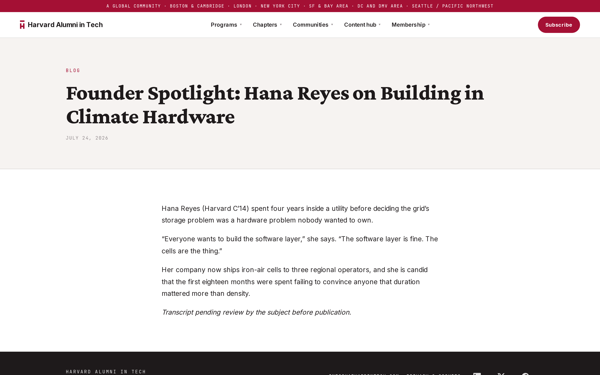
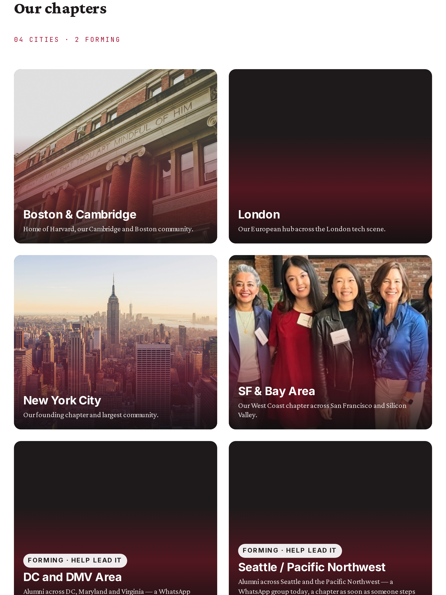

# Harvard in Tech

A modern, statically-exported [Astro](https://astro.build) rebuild of the
[Harvard in Tech](https://www.harvardintech.com/) website — a faithful
reproduction of the original (built on a no-code tool) using modern technology,
hostable for free on GitHub Pages.

Page content lives in typed
[content collections](https://docs.astro.build/en/guides/content-collections/)
(markdown under `src/content/`) and editable JSON singletons (`src/data/`), not a
runtime database — so there is no server to run.
[**@codeyam/cms**](https://www.npmjs.com/package/@codeyam/cms) edits those same
files: an Astro integration that owns **`/admin`** — content dashboard, entry
editor, media library, site settings, and a publish flow that batches edits into
one GitHub commit. See [`CMS_SETUP.md`](./CMS_SETUP.md) for the two sign-in
paths: **Local** and **Token** (paste a fine-grained GitHub PAT).

## Setup

```bash
npm run setup      # install dependencies (+ Playwright browser for captures)
npm run dev        # http://127.0.0.1:4321
npm run build      # responsive image variants, then type-check + static build into dist/
npm run test       # component unit tests (vitest + jsdom)
```

A fresh clone works with: `git clone` → `npm run setup` → `npm run dev`.

### Patched dependency

`@codeyam/cms` is pinned to an exact version and carries a local patch in
`patches/`, applied automatically by `patch-package` on `postinstall`. The patch
adds two admin controls the package does not ship: **reorder arrows** on any
collection declaring a numeric `order`, and **Duplicate** on every entry row,
which opens the ordinary create form prefilled from the source entry. Without
them, rearranging the donate page means opening each section and typing a number
while holding the other five in your head, and starting a section from an
existing one means retyping it. The version is pinned exactly because the patch
is version-stamped: a floating range would install a version the patch cannot
apply to and break `npm install` for everyone. **Duplicate landed upstream in
0.13.0**, so that half of the patch was deleted — the feature moved into the
dependency rather than out of the product. The reorder arrows are still ours.
Both are covered from this repo — `src/lib/cmsOrderControls.test.ts` for the
arrows, `src/lib/duplicateEntry.test.ts` now holding the released Duplicate to
its contract — so if a future release drops or reworks either, CI says so
instead of an editor finding the buttons gone. The arrows belong upstream too;
drop the rest of the patch once they land there. See `CMS_SETUP.md` for the
upgrade procedure.

## Project shape

```
src/
  pages/index.astro          # the landing page — composes the section components
  pages/volunteer.astro       # /volunteer — the volunteer pitch + open-projects grid
  pages/volunteer/projects/[slug].astro
                              # /volunteer/projects/<slug> — one page per project,
                              #   where a project's full markdown description renders
  pages/donate.astro          # /donate — the Momentum Fund campaign page
  pages/events.astro          # /events — Luma calendar embed + upcoming/past listing
  components/landing/         # one component per landing section (Hero, Board, …)
  components/volunteer/       # /volunteer sections (hero, benefits, project cards)
  components/donate/          # /donate campaign sections (hero, stats, gift pillars,
                              #   quotes, donor recognition wall)
  layouts/BaseLayout.astro    # site shell: data-driven header/nav + footer + SEO
  content/                    # typed content collections (events, team, chapters,
                              #   communities, pages, blog, projects, sponsors,
                              #   testimonials, donors, momentumSections, and the
                              #   page copy an editor owns: volunteerPage,
                              #   sponsorPage, sponsorLevels, siteIntegrations,
                              #   pageCopy)
  data/                       # settings.json + nav.json singletons, cms.json +
                              #   collections.json (CMS config). volunteerPage,
                              #   sponsorPage and donatePage still live here as the
                              #   FALLBACK behind their collections — the CMS has no
                              #   notion of a required singleton, so a deleted entry
                              #   degrades to this committed copy rather than a blank page
  lib/                        # site.ts, mailto.ts, drafts.ts (draft filtering),
                              #   personalize.ts (?name= hero personalization), giving.ts
  styles/tokens.css           # design tokens (brand blue, Roboto, spacing)
public/images/                # hero/section backgrounds, board graphic, event gallery
                              # (/admin is injected by @codeyam/cms — no admin code in this repo)
```

## Deploy to GitHub Pages

1. In `astro.config.mjs`, set `site` to your Pages URL and `base` to your repo
   path (drop `base` for a `<user>.github.io` root site).
2. Push to `main` — `.github/workflows/deploy.yml` enables Pages automatically
   (Source: **GitHub Actions**), then builds and deploys. No manual Settings →
   Pages toggle in the common case; see [`DEPLOY_SETUP.md`](./DEPLOY_SETUP.md)
   for the fallback if the first deploy 404s.

<!-- codeyam:run-and-edit:start d=52a406bfa5f4 -->
## Develop this project with codeyam-editor

This project is built with [codeyam-editor](https://codeyam.com) — code and runnable data scenarios are authored side by side against a live preview.

```bash
# Clone the repo
git clone https://github.com/codeyam-ai/harvardintech && cd harvardintech

# Install codeyam-editor
npm install -g @codeyam-editor/codeyam-editor@latest

# Launch the editor (split-screen terminal + live preview)
codeyam-editor start
```
<!-- codeyam:run-and-edit:end -->

<!-- codeyam:scenario-gallery:start d=401017f86c49 -->
## Scenario gallery

States captured as runnable scenarios with codeyam-editor:

### Blog Post - A Retained Medium Stub


A blog post as a reader who still holds its link meets it. This scenario used to show the Welcome post, which was retired when the blog was hidden for launch — the owner decided on 2026-09-14 not to advertise a blog until there are real articles for it. So it now shows one of the ten Medium stubs instead, which is what a retained link actually resolves to: the posts keep building at their own URLs even with every route INTO the blog closed, so nobody holding an old link gets a 404. Note what is ABSENT — the back link that used to sit above the title is gone, because with the blog hidden there is no index for it to return to.

### Blog Preview Link - Shared Draft



The page a reviewer actually lands on. An unpublished post, cloned to an unguessable URL and rendered in the site's real layout — no sign-in, no CMS account, no passphrase. The post it stands in for is still a draft and appears in no listing; this URL is the only way to reach it. Proves the load-bearing half of preview links: routableEntries built a page that publishedEntries deliberately excludes from every index.

### Harvard in Tech - Board On Four Sizes


The board grid at all four widths. It sits far below the fold, so the capture hovers a selector inside the band to bring it into frame - a URL fragment does not scroll a capture, which is why the older /#board scenario shoots the hero instead. Portraits in a grid are the homepage's densest layout, so this is where a column count that works at 1440 and fails at 768 shows up. NARROWED 2026-10-02: this ran at four widths until the capture pipeline stopped finishing it — the screenshot is taken and the verification request that follows returns 502, every time, on this scenario and on the chapters one beside it, while contact-on-four-sizes captures fine at the same four widths. Tablet and Desktop are what remain: Tablet is the intermediate width this frame exists to watch, Desktop is the reference that already works, and the pair still answers the question the four did. Mobile and Laptop go back the moment a four-width capture completes again.

### Chapter Route - New York City


The founding chapter with NO events tagged to it — the counterpart to London, where tags match and the events section appears. Neither an upcoming nor a recent block renders here, which is the assertion: both sections stay away entirely rather than leaving an empty heading behind. It is also the state a chapter sits in whenever its tags are typo'd, since a near-miss tag belongs to nobody and looks exactly like this.

### CMS Analytics And Embeds


The site-wide integration keys on a screen of their own: the analytics measurement id, the Givebutter account id, and the raw head/body HTML escape hatch. Doubles as the live-preview pane's NO-PAGE state — siteIntegrations is the one collection declared with a null path, so the pane says 'This content has no page of its own' and falls back to the plain body preview rather than guessing an address and embedding a 404 beside the form for the whole session.

### Harvard in Tech - Chapters On Four Sizes



The chapters band at all four widths, framed by hovering inside it. Each chapter is a card with a city and a link, so this band answers whether the card grid reflows cleanly or strands a single card on its own row at the intermediate sizes nobody has looked at. NARROWED 2026-10-02: this ran at four widths until the capture pipeline stopped finishing it — the screenshot is taken and the verification request that follows returns 502, every time, on this scenario and on the chapters one beside it, while contact-on-four-sizes captures fine at the same four widths. Tablet and Desktop are what remain: Tablet is the intermediate width this frame exists to watch, Desktop is the reference that already works, and the pair still answers the question the four did. Mobile and Laptop go back the moment a four-width capture completes again. NARROWED AND SEEDED 2026-10-02. Two things were wrong. It ran at four widths until the capture pipeline stopped finishing it — the screenshot is taken and the verification request that follows returns 502 — so Tablet and Desktop are what remain: Tablet is the intermediate width this frame exists to watch, Desktop is the reference that already works. And the seed never carried any CHAPTERS, so the band this scenario is named after rendered nothing the moment the content sandbox started working properly and stopped leaking production content into seeded scenarios; six are seeded now, five active and one forming, because an odd card is exactly the reflow this frame is meant to catch.

### Community Route - Founders With Leads And Events


A community once it has people and a calendar behind it. Its events are tagged the ORIGINAL way — a single chapter tag naming the community — which this seed keeps on purpose: that path still works and this is what proves it. The newer alternative is an event's own communities list, which is what lets one London co-working day sit on the London chapter page and here at the same time without either tag having to win; the production Founders content uses that path, and this scenario deliberately covers the other. Its Join link points at the shared Google Form: this seed previously carried a raw chat.whatsapp.com invite, which put the one pattern the site forbids into a frame that looks like the product.

### CMS Blog - Duplicate Is Not Momentum-Fund-Only


The same Duplicate action on a collection that has nothing to do with the campaign page. It matters because the request that produced this feature was about duplicating a Momentum Fund section, and the easy build would have gated the action to that one collection — which would have been MORE code to make the feature smaller. Duplicate lives in the shared entry-row action cluster instead, so pillar cards, events and blog posts get it for free, and a blog post duplicated here carries its own title, date, summary and body into the create form exactly the way a section does. The one exclusion is a preview row, whose action set is different and whose previewOf marker would otherwise mint a second unlisted clone of the same target. This list also shows the ordinary case for the row label: blog posts carry real titles, so no row is falling back to its slug.
<!-- codeyam:scenario-gallery:end -->
